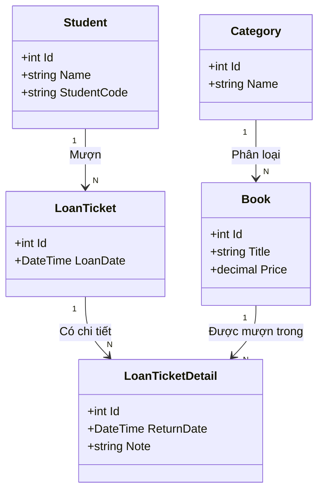

# 🟦 CASE STUDY: PHÂN TÍCH & THIẾT KẾ HỆ THỐNG QUẢN LÝ THƯ VIỆN (OOAD to DATABASE)

> **Mục tiêu tài liệu**: Tài liệu này hướng dẫn cách chuyển đổi từ "Văn bản mô tả nghiệp vụ" sang "Thiết kế cơ sở dữ liệu" một cách khoa học, tránh suy diễn cảm tính.

---

## 1. KHẢO SÁT & MÔ TẢ BÀI TOÁN (PROBLEM DESCRIPTION)

Dưới đây là biên bản ghi lại quá trình quan sát thực tế tại thư viện Đại học DNU. Chúng ta sẽ dùng đoạn văn này làm "nguyên liệu" duy nhất cho thiết kế.

**Quy ước phân tích:**
*   DANH TỪ (MOUNS): Màu xanh dương - Ứng viên cho **Class (Thực thể)** hoặc **Attribute (Thuộc tính)**.
*   ĐỘNG TỪ (VERBS): Màu đỏ, gạch chân - Ứng viên cho **Relationship (Quan hệ)** hoặc **Hành vi**.

### VĂN BẢN MÔ TẢ:
> "Tại thư viện, một Sinh viên (Student) sẽ đến quầy để đăng ký mượn (borrow) các cuốn Sách (Books).
>
> Mỗi cuốn Sách có thông tin cụ thể như Tên sách, Tác giả và thuộc về một Thể loại (Category) nhất định (như IT, Kinh tế...).
>
> Khi thủ thư chấp nhận, hệ thống sẽ tạo ra (creates) một Phiếu mượn (LoanTicket). Trên Phiếu mượn này phải ghi rõ thông tin: ai là người mượn (Sinh viên nào?), Ngày mượn là bao nhiêu.
>
> Đặc biệt, một Phiếu mượn có thể chứa (contains) nhiều cuốn Sách khác nhau. Sau này, khi sinh viên mang sách đến trả (return), thủ thư sẽ ghi nhận Ngày trả thực tế và Tình trạng sách (rách, mất...) vào chi tiết phiếu."

---

## 2. QUY TRÌNH PHÂN TÍCH TỪNG BƯỚC (STEP-BY-STEP ANALYSIS)

Chúng ta sẽ không vẽ ngay biểu đồ. Hãy đi thật chậm qua từng bước sàng lọc.

### BƯỚC 1: LIỆT KÊ & SÀNG LỌC "DANH TỪ" (TÌM CLASS)
Trong mô tả trên, ta nhặt ra được các danh từ: *Sinh viên, Sách, Tên sách, Tác giả, Thể loại, Phiếu mượn, Ngày mượn, Ngày trả, Tình trạng.*

Bây giờ ta sàng lọc chúng:

1.  **Sinh viên (Student)**:
    *   *Hỏi*: Hệ thống có cần quản lý thông tin riêng của sinh viên (Mã, Tên, Lớp) không? -> Có.
    *   *Kết luận*: Đây là một **Thực thể (Class)**.

2.  **Sách (Book)**:
    *   *Hỏi*: Sách có phải đối tượng chính không? -> Có.
    *   *Kết luận*: Đây là một **Thực thể (Class)**.

3.  **Tên sách, Tác giả (Title, Author)**:
    *   *Hỏi*: "Tên sách" có đứng một mình được không? Hay nó luôn phải thuộc về một cuốn sách?
    *   *Trả lời*: Nó luôn thuộc về cuốn sách.
    *   *Kết luận*: Đây là **Thuộc tính (Attribute)** của Class `Book`.

4.  **Thể loại (Category)**:
    *   *Hỏi*: Tại sao không để "Thể loại" là thuộc tính (String) của Book?
    *   *Tư duy*: Nếu để là String, khi muốn sửa tên thể loại "IT" thành "Công nghệ", ta phải sửa hàng ngàn cuốn sách. Nếu tách ra bảng riêng, ta chỉ sửa 1 dòng.
    *   *Kết luận*: Nên tách thành **Thực thể (Class Category)**.

5.  **Phiếu mượn (LoanTicket)**:
    *   *Hỏi*: Cái này trừu tượng này? Có cần tạo Class không?
    *   *Tư duy*: Nếu không có nó, làm sao ta biết Sinh viên A mượn Sách B vào **ngày nào**? Sách B được trả vào **ngày nào**? Ta cần một đối tượng để lưu trữ "Biên bản giao dịch".
    *   *Kết luận*: **Thực thể (Class)** quan trọng.

---

### BƯỚC 2: PHÂN TÍCH "ĐỘNG TỪ" (TÌM QUAN HỆ)

Quan hệ (Relationship) trả lời câu hỏi: *Các Class kết nối với nhau như thế nào?*

1.  **Động từ: "Đăng ký mượn"** (Giữa *Sinh viên* và *Phiếu mượn*)
    *   *Câu hỏi 1*: Một Sinh viên có thể có bao nhiêu Phiếu mượn? -> Nhiều (Mượn tuần này, tuần sau mượn tiếp...).
    *   *Câu hỏi 2*: Một phiếu mượn thuộc về mấy sinh viên? -> Duy nhất 1 (Không có phiếu chung).
    *   -> **Kết luận**: Quan hệ **1 - Nhiều (1 System - N LoanTicket)**.

2.  **Động từ: "Thuộc về"** (Giữa *Sách* và *Thể loại*)
    *   *Câu hỏi 1*: Một Sách thuộc mấy Thể loại? -> (Trong bài toán này) là 1.
    *   *Câu hỏi 2*: Một Thể loại có mấy Sách? -> Rất nhiều.
    *   -> **Kết luận**: Quan hệ **1 - Nhiều (1 Category - N Book)**.

3.  **Động từ: "Chứa"** (Giữa *Phiếu mượn* và *Sách*)
    *   *Câu hỏi 1*: Một Phiếu có thể chứa nhiều Sách không? -> Có (Ví dụ, bạn mượn 3 cuốn cùng lúc).
    *   *Câu hỏi 2*: Một cuốn Sách (Ví dụ: "Dế mèn phiêu lưu ký" mã số 001) có thể nằm trong nhiều phiếu không? -> Có (Tháng 1 bạn A mượn, trả xong Tháng 2 bạn B mượn).
    *   -> **Kết luận**: Quan hệ **Nhiều - Nhiều (N-N)**.

> **⚠️ LƯU Ý QUAN TRỌNG VỀ KỸ THUẬT**:
> Trong thiết kế Database, chúng ta **KHÔNG THỂ** nối trực tiếp quan hệ N-N.
> **Giải pháp**: Luôn phải tách thành 2 quan hệ 1-N thông qua một **Bảng trung gian**.
> Ta đặt tên bảng này là: **Chi tiết phiếu mượn (LoanTicketDetail)**.

---

### BƯỚC 3: XÂY DỰNG BIỂU ĐỒ LỚP (CLASS DIAGRAM)

Sau khi phân tích kỹ, ta vẽ sơ đồ các Class (Thực thể) và các dây nối (Quan hệ).

> **Giải thích sơ đồ:**
> *   `Student` trỏ sang `LoanTicket`: 1 sinh viên có danh sách các phiếu mượn.
> *   `LoanTicketDetail` nằm giữa `LoanTicket` và `Book`: Đây chính là bảng trung gian để giải quyết quan hệ Nhiều-Nhiều. Nó lưu thêm thông tin: *Quyển sách này trong phiếu này bao giờ thì trả?*

---

## 3. CHUYỂN ĐỔI SANG THIẾT KẾ CƠ SỞ DỮ LIỆU (DATABASE SCHEMA)

Đây là bước cuối cùng: "Ánh xạ" (Map) từ Sơ đồ Class ở trên thành Bảng (Table) trong SQL Server.

**Quy tắc vàng khi Ánh xạ:**
1.  **Class** -> Thành **Table**.
2.  **Attribute** -> Thành **Column**.
3.  **Mũi tên quan hệ** -> Thành **Foreign Key (Khóa ngoại)**.
    *   *Mẹo nhớ*: Mũi tên chỉ từ 1 sang N, thì bảng bên **N** sẽ giữ khóa ngoại của bảng bên 1. (Ví dụ: Mũi tên từ Category sang Book -> Bảng Book sẽ có cột `CategoryId`).

| Tên Bảng (Table) | Cột (Columns) | Giải thích Khóa ngoại (Tại sao có cột này?) |
| :--- | :--- | :--- |
| **Categories** | `Id`, `Name` | Không có (Bảng độc lập). |
| **Books** | `Id`, `Title`, `Author`, `Price`, **`CategoryId`** | Cột `CategoryId` để biết sách này thuộc thể loại nào. |
| **Students** | `Id`, `StudentCode`, `FullName` | Không có. |
| **LoanTickets** | `Id`, `LoanDate`, **`StudentId`** | Cột `StudentId` để biết phiếu này là của ai. |
| **LoanTicketDetails** | `Id`, `ReturnDate`, `Note`, **`LoanTicketId`**, **`BookId`** | Chứa 2 khóa ngoại để nối Phiếu và Sách lại với nhau. |

---

## 6. LỜI KẾT DÀNH CHO CÁC BẠN SINH VIÊN

Khi thiết kế cơ sở dữ liệu, các bạn hãy nhớ quy trình tư duy:

1.  **Đừng bắt đầu bằng Table**: Đừng vội vàng tạo bảng A, bảng B. Hãy bắt đầu bằng câu hỏi: *"Hệ thống này cần quản lý những đối tượng gì?"* (Sách, Người mượn, Phiếu mượn...).
2.  **Đặt câu hỏi "Tại sao"**:
    *   *Tại sao cần bảng chi tiết mượn?* -> Vì một lần mượn được nhiều sách.
    *   *Tại sao cần khóa ngoại?* -> Để máy tính hiểu mối liên kết giữa các bảng.
3.  **Code First là hệ quả**: Khi Sơ đồ Lớp (Class Diagram) đã rõ ràng, việc viết Code C# class (Entity) là sự chuyển đổi tự nhiên 1-1. Lập trình chính là sự phản ánh logic của thực tế.
