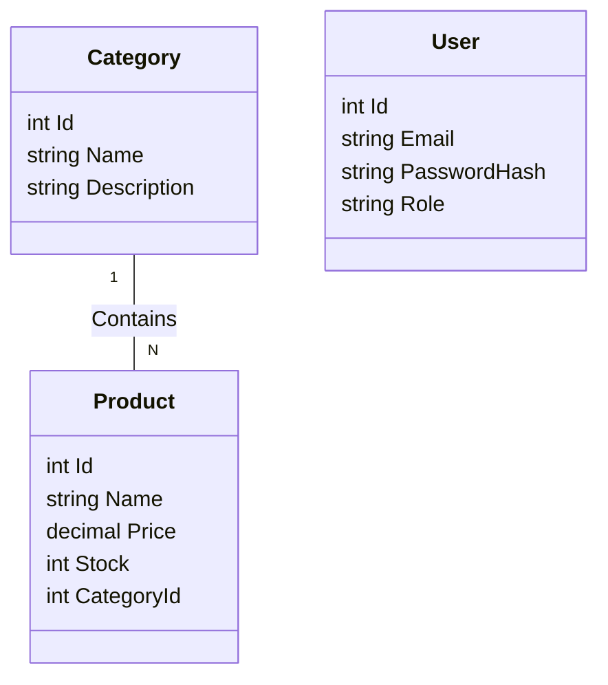

# 🧪 LAB 01: KHỞI TẠO DỰ ÁN & THIẾT KẾ CƠ SỞ DỮ LIỆU
**(Tương ứng: Module 01 - Week 1)**

## 🎯 Mục tiêu
- **Hiểu sâu:** Quy trình phát triển phần mềm theo mô hình "Code First".
- **Phân tích:** Tại sao cần phân tích dữ liệu trước khi code?
- **Thực hành:**
  - Khởi tạo dự án chuẩn công nghiệp.
  - Thiết kế Entities (Thực thể) đại diện cho dữ liệu.
  - Sử dụng EF Core để tự động sinh ra Database.

---

## 1. 🔍 PHÂN TÍCH & THIẾT KẾ HỆ THỐNG (TƯ DUY TRƯỚC KHI CODE)

### 1.1. Yêu cầu bài toán
Hệ thống Thương mại điện tử (E-Shop) về cơ bản là nơi quản lý việc mua bán. Để làm được điều đó, chúng ta cần quản lý những "đối tượng" nào?

*   **Sản phẩm (Product):** Là hạt nhân của hệ thống. Cần có Tên, Giá, Số lượng, Mô tả.
*   **Danh mục (Category):** Để phân loại sản phẩm (VD: Điện thoại, Laptop). Giúp khách hàng dễ tìm kiếm.
*   **Người dùng (User):** Là người mua hàng hoặc người quản trị.

### 1.2. Mối quan hệ (Relationships)
Hãy tưởng tượng:
- Một Danh mục "Điện thoại" có thể chứa: iPhone 15, Samsung S24... -> **Quan hệ 1-Nhiều (1-N)**.
- Một Sản phẩm "iPhone 15" chỉ thuộc về danh mục "Điện thoại" -> **Quan hệ N-1**.

### 1.3. Thiết kế Sơ đồ ERD (Entity Relationship Diagram)



---

## 2. 🛠️ CÀI ĐẶT MÔI TRƯỜNG

Đảm bảo bạn đã sẵn sàng:
1.  **Visual Studio 2022:** IDE mạnh mẽ nhất cho .NET.
2.  **SQL Server Management Studio (SSMS):** Công cụ quản lý Database.
3.  **.NET SDK 6/8:** Bộ thư viện nền tảng.

---

## 3. 💻 HƯỚNG DẪN THỰC HÀNH TỪNG BƯỚC

### Bước 1: Khởi tạo Project (Khung sườn)

Chúng ta sẽ tạo một **Solution** (giải pháp chứa nhiều dự án con) và một **Web API Project**.

Mở Terminal (hoặc CMD) và gõ từng lệnh, đọc kỹ giải thích:

```powershell
# 1. Tạo thư mục chứa code
mkdir EShop_Project
cd EShop_Project

# 2. Tạo Solution file (.sln) 
# -> Giống như tạo một "Container" rỗng để chứa các project con.
dotnet new sln -n EShop

# 3. Tạo Web API Project
# -> Đây là project chính, nơi chứa code API.
dotnet new webapi -n EShop.API

# 4. Thêm project vào solution
# -> Gắn kết project vào solution để Visual Studio hiểu logic quản lý.
dotnet sln add EShop.API/EShop.API.csproj
```

### Bước 2: Cài đặt Entity Framework Core (ORM)

**Entity Framework Core (EF Core)** là một "người phiên dịch". Nó giúp bạn viết code C# nhưng lại thao tác được với SQL Server.

Chuyển vào thư mục project: `cd EShop.API`

Cài đặt 3 gói thư viện quan trọng:

```powershell
# 1. Gói chính để làm việc với SQL Server
dotnet add package Microsoft.EntityFrameworkCore.SqlServer

# 2. Gói công cụ (Tools) để chạy các lệnh trong terminal
dotnet add package Microsoft.EntityFrameworkCore.Tools

# 3. Gói thiết kế (Design) hỗ trợ quá trình tạo code tự động
dotnet add package Microsoft.EntityFrameworkCore.Design
```

### Bước 3: Định nghĩa Models (Xương sống dữ liệu)

Models là các class C# đại diện cho các bảng trong Database.
*   Class C# = Bảng SQL
*   Property = Cột SQL

Tạo thư mục `Models` và tạo các file sau:

**1. Models/Category.cs**
```csharp
using System.ComponentModel.DataAnnotations;

namespace EShop.API.Models
{
    public class Category
    {
        public int Id { get; set; } // Khóa chính (Primary Key) tự tăng

        [Required]      // Bắt buộc nhập (NOT NULL trong SQL)
        [MaxLength(100)] // Độ dài tối đa 100 ký tự (NVARCHAR(100))
        public string Name { get; set; } = string.Empty;

        public string? Description { get; set; } // Dấu '?' nghĩa là có thể null

        // Navigation Property: Giúp EF Core hiểu mối quan hệ
        // Một Category chứa danh sách nhiều Product
        public ICollection<Product> Products { get; set; } = new List<Product>();
    }
}
```

**2. Models/Product.cs**
```csharp
using System.ComponentModel.DataAnnotations;
using System.ComponentModel.DataAnnotations.Schema;

namespace EShop.API.Models
{
    public class Product
    {
        public int Id { get; set; }

        [Required]
        [MaxLength(200)]
        public string Name { get; set; } = string.Empty;

        [Column(TypeName = "decimal(18,2)")] // Quan trọng: Định dạng tiền tệ
        public decimal Price { get; set; }

        public int Stock { get; set; }
        
        public string? Description { get; set; }

        // --- Thiết lập Khóa Ngoại (Foreign Key) ---
        // Property này lưu giá trị ID (VD: 1, 2)
        public int CategoryId { get; set; }

        // Navigation Property này giúp truy cập đối tượng Category (VD: Product.Category.Name)
        public Category Category { get; set; } = null!;
    }
}
```

**3. Models/User.cs**
```csharp
using System.ComponentModel.DataAnnotations;

namespace EShop.API.Models
{
    public class User
    {
        public int Id { get; set; }

        [Required]
        [EmailAddress] // Validate định dạng Email
        public string Email { get; set; } = string.Empty;

        [Required]
        public string PasswordHash { get; set; } = string.Empty; // Mật khẩu đã mã hóa

        public string Role { get; set; } = "Customer"; // Vai trò
    }
}
```

### Bước 4: Thiết lập DbContext (Cầu nối Database)

`DbContext` giống như "người quản lý kho". Mọi thao tác thêm/sửa/xóa dữ liệu đều phải thông qua class này.

Tạo thư mục `Data` -> Tạo class `AppDbContext.cs`:

```csharp
using EShop.API.Models;
using Microsoft.EntityFrameworkCore;

namespace EShop.API.Data
{
    // Kế thừa từ DbContext có sẵn của EF Core
    public class AppDbContext : DbContext 
    {
        // Constructor: Nhận cấu hình (Connection String) từ bên ngoài truyền vào
        public AppDbContext(DbContextOptions<AppDbContext> options) : base(options)
        {
        }

        // Khai báo các bảng (DbSet)
        // Mỗi DbSet đại diện cho một bảng trong SQL Server
        public DbSet<Category> Categories { get; set; }
        public DbSet<Product> Products { get; set; }
        public DbSet<User> Users { get; set; }

        // Hàm này chạy khi Database được tạo. Dùng để Seed Data (Dữ liệu mẫu)
        protected override void OnModelCreating(ModelBuilder modelBuilder)
        {
            base.OnModelCreating(modelBuilder);

            // Thêm sẵn 2 danh mục mẫu
            modelBuilder.Entity<Category>().HasData(
                new Category { Id = 1, Name = "Điện tử", Description = "Laptop, PC, Mobile" },
                new Category { Id = 2, Name = "Thời trang", Description = "Quần áo, Giày dép" }
            );

            // Thêm sẵn 2 sản phẩm mẫu
            modelBuilder.Entity<Product>().HasData(
                new Product { Id = 1, Name = "iPhone 15", Price = 25000000, Stock = 10, CategoryId = 1 },
                new Product { Id = 2, Name = "Áo thun", Price = 150000, Stock = 100, CategoryId = 2 }
            );
        }
    }
}
```

### Bước 5: Cấu hình Kết nối

Mở `appsettings.json`. Thêm chuỗi kết nối vào.
*   **Server=.:** Dấu chấm đại diện cho Localhost (máy của bạn).
*   **Database=EShopDB:** Tên Database sẽ được tạo.
*   **Trusted_Connection=True:** Dùng tài khoản Windows để đăng nhập SQL, không cần user/pass.

```json
{
  "ConnectionStrings": {
    "DefaultConnection": "Server=.;Database=EShopDB;Trusted_Connection=True;MultipleActiveResultSets=true;TrustServerCertificate=True"
  },
  "Logging": { ... }
}
```

Trong `Program.cs`, khai báo dịch vụ DB:

```csharp
// ...
using EShop.API.Data;
using Microsoft.EntityFrameworkCore;

var builder = WebApplication.CreateBuilder(args);
// ...

// --- ĐĂNG KÝ EF CORE ---
// Lấy chuỗi kết nối từ appsettings.json
var connectionString = builder.Configuration.GetConnectionString("DefaultConnection");

// Báo cho ứng dụng biết: Chúng ta dùng SQL Server với chuỗi kết nối này
builder.Services.AddDbContext<AppDbContext>(options =>
    options.UseSqlServer(connectionString));

var app = builder.Build();
// ...
```

### Bước 6: Migrations (Sinh Database)

Đây là phép màu của Code First. Bạn không cần mở SQL Management Studio để `CREATE TABLE`.

Mở Terminal tại folder chứa `.csproj`:

```powershell
# 1. Tạo bản thiết kế (Snapshot) của Database dựa trên code hiện tại
dotnet ef migrations add InitialCreate

# 2. Thực thi bản thiết kế đó lên SQL Server thực tế
dotnet ef database update
```

**Kết quả:** Mở SQL Server lên, bạn sẽ thấy Database `EShopDB` xuất hiện với đầy đủ bảng và dữ liệu mẫu!

### Bước 7: API Test (Kiểm tra kết quả)

Tạo `Controllers/TestController.cs` để query thử dữ liệu.

```csharp
using EShop.API.Data;
using Microsoft.AspNetCore.Mvc;
using Microsoft.EntityFrameworkCore;

namespace EShop.API.Controllers
{
    [Route("api/[controller]")]
    [ApiController]
    public class TestController : ControllerBase
    {
        private readonly AppDbContext _context;

        // DI: Inject DbContext đã cấu hình ở Bước 5 vào đây để dùng
        public TestController(AppDbContext context)
        {
            _context = context;
        }

        [HttpGet]
        public async Task<IActionResult> GetProducts()
        {
            // Lấy list sản phẩm, kèm theo thông tin Category
            // .Include() giống như lệnh JOIN trong SQL
            var products = await _context.Products.Include(p => p.Category).ToListAsync();
            
            return Ok(products); // Trả về JSON 200 OK
        }
    }
}
```

Chạy Project (`fn+F5`) -> Vào Swagger (`/swagger`) -> Gọi API -> Nhận kết quả JSON.

---

## 🐞 GỠ LỖI (DEBUGGING GUIDE)

*   **Lỗi:** *A network-related or instance-specific error occurred...*
    *   **Nguyên nhân:** Sai tên Server trong connection string.
    *   **Khắc phục:** Mở SSMS, xem Server Name lúc đăng nhập, copy lại chính xác. Thay `.` bằng tên đó hoặc `(localdb)\\mssqllocaldb`.

*   **Lỗi:** *Certificate chain was issued by an authority that is not trusted.*
    *   **Khắc phục:** Thêm `TrustServerCertificate=True` vào chuỗi kết nối.
